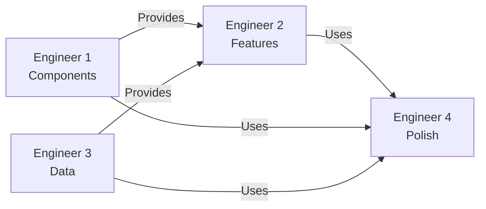

# Opus 4 Engineering Team Coordination

## Team Structure

### The 4-Engineer Parallel Architecture

```
┌─────────────────┐  ┌─────────────────┐  ┌─────────────────┐  ┌─────────────────┐
│   Engineer 1    │  │   Engineer 2    │  │   Engineer 3    │  │   Engineer 4    │
│   Foundation    │  │    Features     │  │      Data       │  │   Performance   │
│                 │  │                 │  │                 │  │                 │
│ • Design System │  │ • User Flows    │  │ • APIs          │  │ • Testing       │
│ • Components    │  │ • Pages         │  │ • Web3          │  │ • Optimization  │
│ • Responsive    │  │ • Calculator    │  │ • Real-time     │  │ • Animations    │
│ • Theme         │  │ • Staking       │  │ • State Mgmt    │  │ • Production    │
└─────────────────┘  └─────────────────┘  └─────────────────┘  └─────────────────┘
         │                    │                    │                    │
         └────────────────────┴────────────────────┴────────────────────┘
                                        │
                                 interfaces.json
                              (Central Communication)
```

## Quick Start for Each Engineer

### Engineer 1: Foundation Architect
```bash
# Your workspace
cd src/components
cd src/styles

# Your workflow doc
docs/engineer-workflows/ENGINEER_1_FOUNDATION.md

# Start with:
1. Design tokens setup
2. Core components (Button, Card, Input)
3. Update interfaces.json with component APIs
```

### Engineer 2: Feature Builder
```bash
# Your workspace
cd app/

# Your workflow doc
docs/engineer-workflows/ENGINEER_2_FEATURES.md

# Start with:
1. Page routes setup
2. Homepage with static content
3. Update interfaces.json with data needs
```

### Engineer 3: Data Orchestrator
```bash
# Your workspace
cd app/api
cd src/lib

# Your workflow doc
docs/engineer-workflows/ENGINEER_3_DATA.md

# Start with:
1. API routes structure
2. Mock data system
3. Update interfaces.json with endpoints
```

### Engineer 4: Performance Guardian
```bash
# Your workspace
cd tests/
Root config files

# Your workflow doc
docs/engineer-workflows/ENGINEER_4_PERFORMANCE.md

# Start with:
1. Test framework setup
2. Performance monitoring
3. Update interfaces.json with targets
```

## Communication Protocol

### 1. Interfaces.json Updates
- **When**: Every time you create/modify an interface
- **What**: Update your section with current status
- **Why**: Other engineers depend on knowing what's available

### 2. Commit Schedule
- Every 2 hours minimum
- Clear commit messages
- Feature branch naming: `feat/engineer[1-4]-description`

### 3. Integration Checkpoints
- **Every 6 hours**: Automated integration build
- **Every 12 hours**: Cross-engineer sync (via interfaces.json)
- **Every 24 hours**: Full system test

## Dependency Management

### Non-Blocking Dependencies



### How to Work Without Blocking

#### Engineer 1 Blocked on Nothing
- Start immediately with design system
- Build components in isolation
- Use Storybook for development

#### Engineer 2 Not Blocked by Engineer 1
- Use HTML/Tailwind for initial layouts
- Replace with components as available
- Check interfaces.json for component status

#### Engineer 3 Not Blocked by Anyone
- Create comprehensive mock data first
- Build API structure independently
- Real integrations can come later

#### Engineer 4 Not Blocked Initially
- Set up infrastructure immediately
- Add tests as features complete
- Progressive enhancement approach

## Daily Workflow

### Morning (Start of Day)
1. Pull latest from main
2. Check interfaces.json for updates
3. Review your workflow document
4. Plan your 2-hour sprints

### Midday Check-in
1. Commit current work
2. Update interfaces.json
3. Run your domain tests
4. Check integration build status

### Evening Wrap-up
1. Final commit of the day
2. Update status in interfaces.json
3. Note any blockers for tomorrow
4. Push all changes

## Success Metrics by Day

### Day 1 Targets
- **E1**: 15+ components built
- **E2**: All pages routed
- **E3**: Mock data complete
- **E4**: Test framework ready

### Day 2 Targets
- **E1**: All components done
- **E2**: Features functional
- **E3**: APIs connected
- **E4**: Animations added

### Day 3 Targets
- **E1**: Polish & docs
- **E2**: Real data integrated
- **E3**: Web3 working
- **E4**: Performance optimal

### Day 4 Targets
- **All**: Production ready
- **All**: Tests passing
- **All**: Docs complete
- **All**: Deploy ready

## Conflict Resolution

### File Conflicts
- Impossible due to folder separation
- Each engineer owns their directories

### Interface Conflicts
- interfaces.json is append-only
- Never modify other engineers' sections
- Discuss in PR if changes needed

### Integration Conflicts
- Engineer 4 has final say on quality
- Performance trumps features
- User experience trumps developer experience

## Tools & Resources

### Shared Tools
- **Version Control**: Git with feature branches
- **Communication**: interfaces.json + commit messages
- **Testing**: Vitest + Playwright
- **Building**: Next.js + Turbopack

### Engineer-Specific Tools
- **E1**: Storybook, Figma
- **E2**: Chrome DevTools, Mobile devices
- **E3**: Postman, Web3 tools
- **E4**: Lighthouse, Bundle analyzer

## Emergency Procedures

### If Blocked
1. Check interfaces.json for alternatives
2. Use mock/temporary solution
3. Document blocker in interfaces.json
4. Continue with other tasks

### If Behind Schedule
1. Focus on critical path only
2. Reduce scope, not quality
3. Update interfaces.json with revised targets
4. Communicate via commit messages

### If Integration Fails
1. Revert to last working build
2. Isolate the issue
3. Fix in isolation
4. Re-integrate carefully

## The Golden Rules

1. **Communicate through code** - interfaces.json is truth
2. **Commit early and often** - Every 2 hours minimum
3. **Own your domain** - 100% responsibility for your area
4. **Respect the interfaces** - Don't break contracts
5. **Quality over features** - Better to do less, perfectly

## Final Checklist

Before marking your work complete:
- [ ] All interfaces documented in interfaces.json
- [ ] All tests passing in your domain
- [ ] No console errors
- [ ] Works on mobile
- [ ] Performance targets met
- [ ] Code is production-ready

---

**Remember**: We're building in parallel, not in sequence. The magic happens when four minds work independently toward a shared vision, communicating through clean interfaces and meeting in perfect harmony at the end.

**Go forth and build at the speed of AI!** 🚀